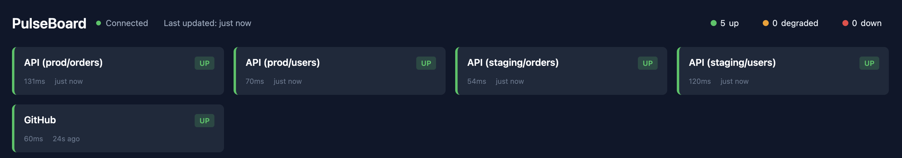

# PulseBoard

Pulseboard started as a Hackathon project at a previous job. We would spam slack channels with health statuses, which were noisy and as a result muted and ignored. I decided to transform this into a health dashboard. As a winter project a year later, I abstracted this solution into a library, for quick and easy use. 

[](https://github.com/jpalmerr/pulseboard/actions/workflows/ci.yml)
[](https://pkg.go.dev/github.com/jpalmerr/pulseboard)

A Go library that adds a live status dashboard to your application — no external services required.



## Why PulseBoard?

- **No infrastructure**: Runs inside your application, not as a separate service
- **Real-time updates**: Built-in Server-Sent Events for live dashboard
- **Flexible**: Extract status from JSON fields, regex patterns, or HTTP codes
- **Simple**: Get a dashboard running in minutes

## Quick Start

### Option 1: CLI

```bash
go install github.com/jpalmerr/pulseboard/cmd/pulseboard@latest

cat > config.yaml << 'EOF'
endpoints:
  - name: GitHub API
    url: https://api.github.com
EOF

pulseboard serve -c config.yaml
```

### Option 2: Go SDK

```go
api, _ := pulseboard.NewEndpoint("API", "https://api.example.com/health")
pb, _ := pulseboard.New(pulseboard.WithEndpoint(api))

ctx, stop := signal.NotifyContext(context.Background(), syscall.SIGINT, syscall.SIGTERM)
defer stop()

pb.Start(ctx) // Dashboard at http://localhost:8080
```

### Option 3: Docker

```bash
cat > config.yaml << 'EOF'
endpoints:
  - name: GitHub API
    url: https://api.github.com
EOF

docker run -v $(pwd)/config.yaml:/config.yaml -p 8080:8080 \
  ghcr.io/jpalmerr/pulseboard:latest
```

## Which Option?

| Approach | Best For |
|----------|----------|
| **CLI** | Quick local setup, config-driven workflows |
| **SDK** | Embedding in Go applications, programmatic control |
| **Docker** | Container infrastructure, CI/CD pipelines, no Go required |

## When to Use PulseBoard

- **Internal tools**: Add a status page to admin panels
- **Microservice health**: Monitor dependencies from within your service
- **Development**: Instant observability without infrastructure
- **Prototyping**: Dashboard running in minutes, not hours

## Installation

```bash
go get github.com/jpalmerr/pulseboard
```

Requires Go 1.23 or later.

## API Endpoints

| Endpoint | Description |
|----------|-------------|
| `GET /` | Dashboard UI |
| `GET /api/status` | JSON array of current statuses |
| `GET /api/sse` | Server-Sent Events stream |

## Example

```bash
git clone https://github.com/jpalmerr/pulseboard.git
cd pulseboard
go run ./example
```

Open http://localhost:8080 to see mock services cycling through status changes.

## Documentation

- **[CLI Guide](docs/cli-guide.md)** - YAML configuration, environment variables, grid endpoints
- **[Library Guide](docs/library-guide.md)** - SDK options, custom extractors, callbacks, integration patterns
- **[Docker Guide](docs/docker-guide.md)** - Container deployment, Compose, Kubernetes
- **[API Reference](https://pkg.go.dev/github.com/jpalmerr/pulseboard)** - Full godoc

## License

TBD
